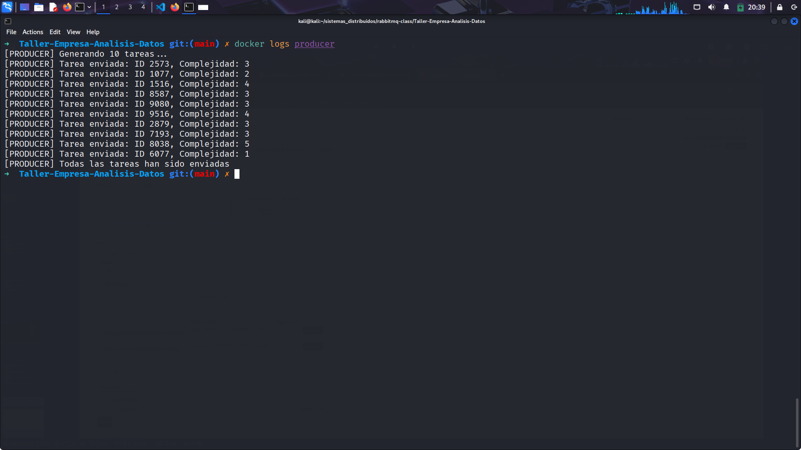
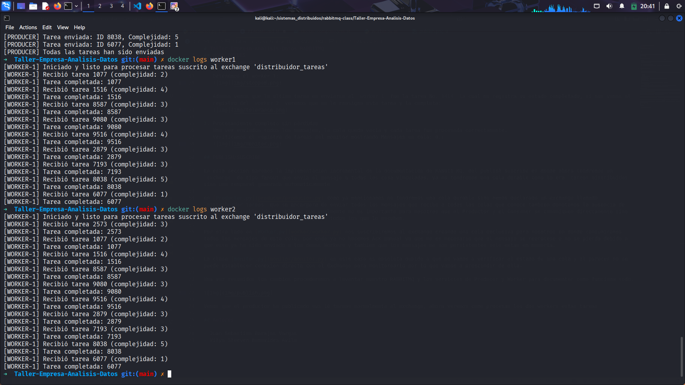
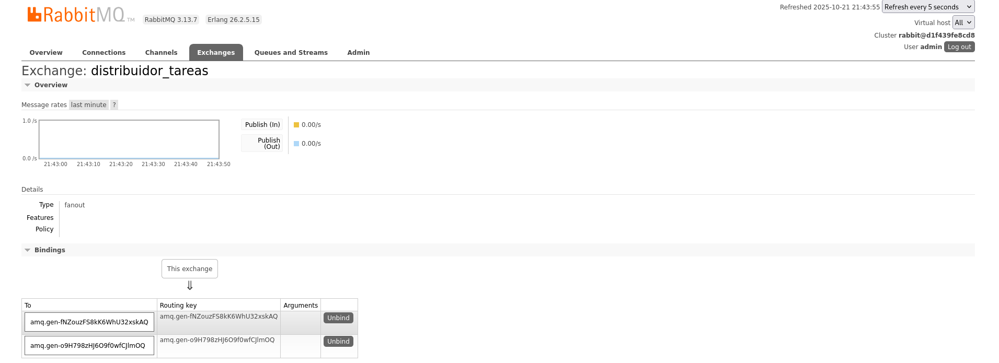

# Taller-Empresa-Analisis-Datos RABBITMQ

## WORK QUEUES

### Instrucciones de Prueba:

Para ejecutar el siguiente proyecto en la terminal correremos el `docker-compose.yml` de la siguiente manera:

```zsh
docker-compose up -d --build
```

y verificamos que todos nuestros contenedores se encuentren corriendo


### Flujo del sistema


1. Producer envía 10 tareas a la cola **tareas_distribuidas** en RabbitMQ.

2. RabbitMQ reparte las tareas entre los dos workers usando round-robin y prefetch_count=1.

3. Cada worker procesa la tarea:

   3.1. Si termina bien → envía ACK.

   3.2. Si falla (simulación) → no envía ACK y RabbitMQ vuelve a ponerla en la cola.

4. El monitor consulta cada segundo el estado de la cola y muestra cuántos mensajes están pendientes.

### Evidencias de Ejecucion

1. Distribución inicial equilibrada

   El producer envia los mensajes a la cola:
   
   Cada mensaje enviado a la cola tareas_distribuidas se reparte de manera balanceada entre los workers activos.:

   - Worker 1:
     
   - Worker 2:
     

2. Tolerancia a fallos
   Si se detiene un worker, el otro continúa procesando sin pérdida de datos.

   Detenemos el worker 1:
   

   Ademas vemos que la ultima tarea en enviarse al `worker 1` fue la tarea No.`1414` la cual no registra su estado completado, si nos vamos al registro del `worker 2` veremos que se le reasigna esta tarea y la completa:
   

3. Procesamiento completo sin pérdidas
   Una vez enviados todos los mensajes, la cola queda vacía y cada tarea fue procesada correctamente.
   Verificamos el registro de tareas del monitor mostrando Mensajes en cola: 0.:
   

## PUBLISH/SUSCRIBE

En esta seccion haremos la implementacion incremental de la documentacion de RABBIT MQ, del publish suscribe en donde ahora tendremos un `exchange` de tipo fanout que envia el mensaje a todas las cosa vinculadas. ya no tendremos una cola durable como lo era `tareas_distribuidas` sino una temporal generada automaticamente

en [Productor.py](producer/productor.py) como ya mencionamos no tendremos una cola durable sino hemos declarado un exchange llamado `distribuidor_tareas` que se encargara de enviar todos los mensajes que recibe a todas las colas que conoce tambien denotamos la ausencia de la cola preestablecida durable ya que realmente no es importante para nosotros que el Productor y el Consumer se comuniquen directamente sino queremos enviar todos nuestros mensajes a todos los que lo escuhen.

Por otro lado en [Worker.py](worker/worker.py) nos suscribiremos al exchange creando una cola exclusiva para nosotros en donde consumiremos todos los mensajes de esta cola, por ende ya no hacemos Ack manual ya que no es necesario que el mensaje se reprocese o no se pierda debido a que este ya ha sido enviado a los demas Workers y tambien que los mensajes no son persistentes solo estan en memoria.

La clase [monitor.py](monitor/monitor.py) en este caso es obsoleta debido a que no vamos a verificar el estado de una cola y al parecer no se puede establecer conexion directa con el Exchange para monitorearlo por lo que vamos a prescindir de ella.

Una vez resumidos los cambios procederemos a levantar nuestro RABBITMQ y los servicios de Producer y Worker para documentar como funciona todo.



Vemos que el productor ha publicado sus 10 tareas normalmente al exchange, ahora veremos como procesan los dos workers estas tareas:



Por otro lado vemos que los dos workers han recibido los mismos 10 mensajes y los han procesado cada uno por su lado, como se evidencia en el registro del dashboard RABBITMQ del exchange



## Autores

- Juan Sebastian Barajas Vargas
- Vitys Steeven Benavides Avila
