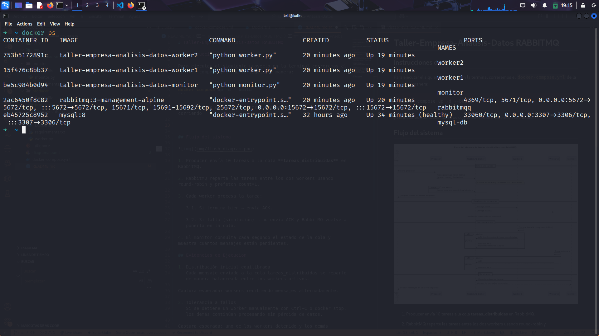
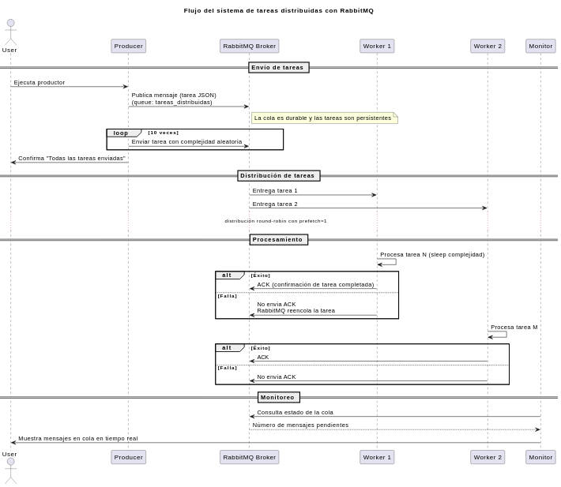
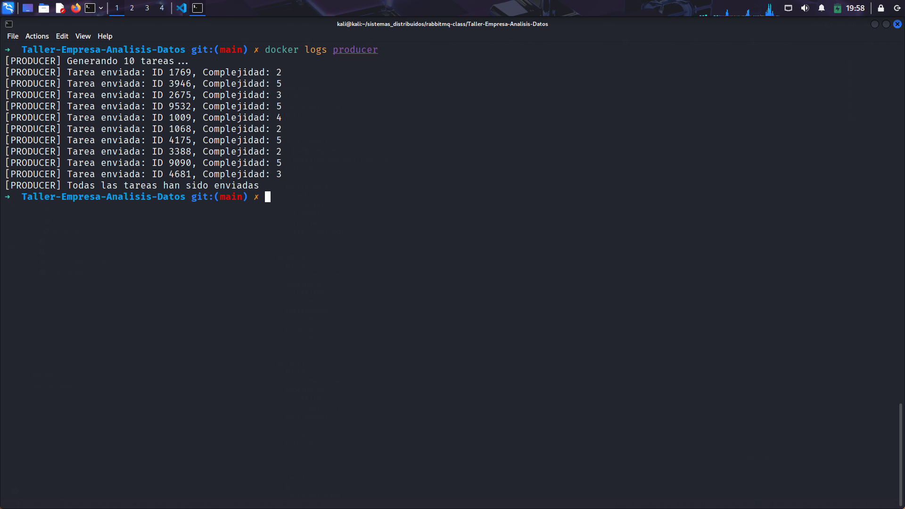
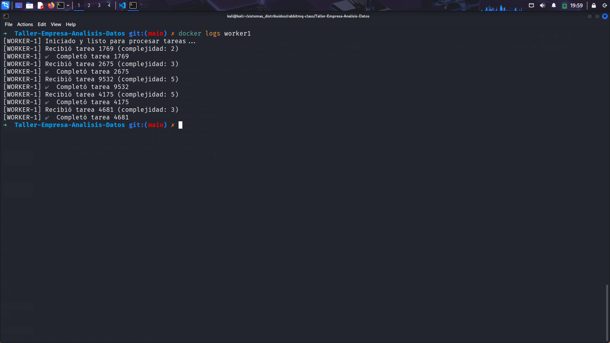
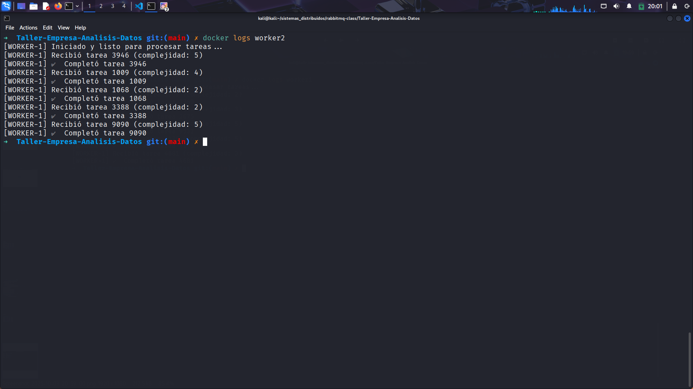
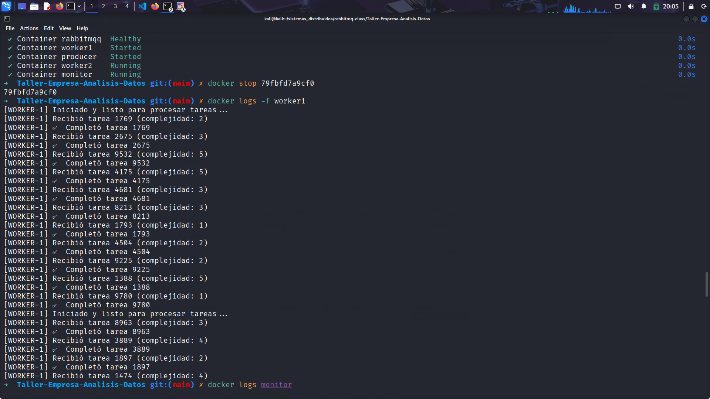
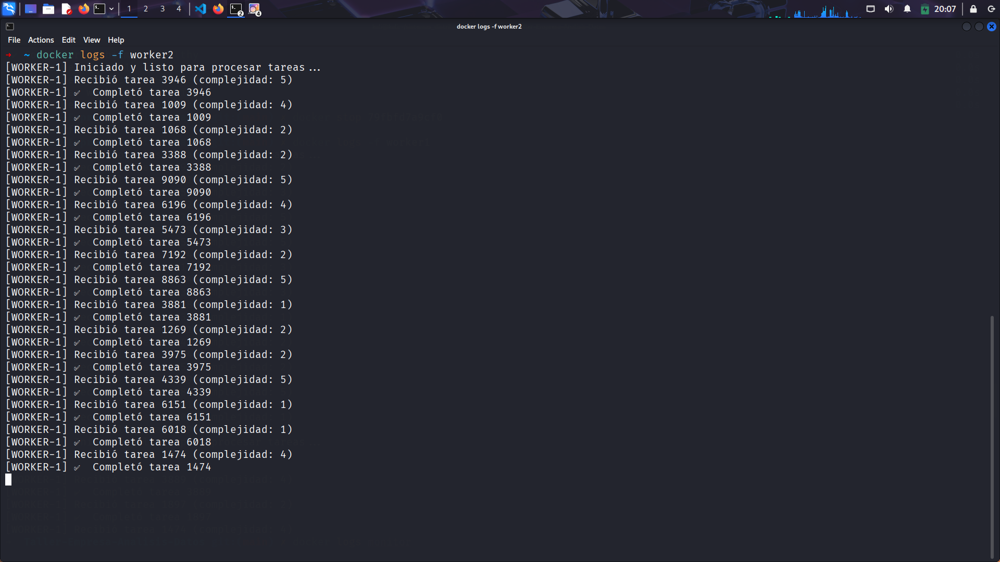
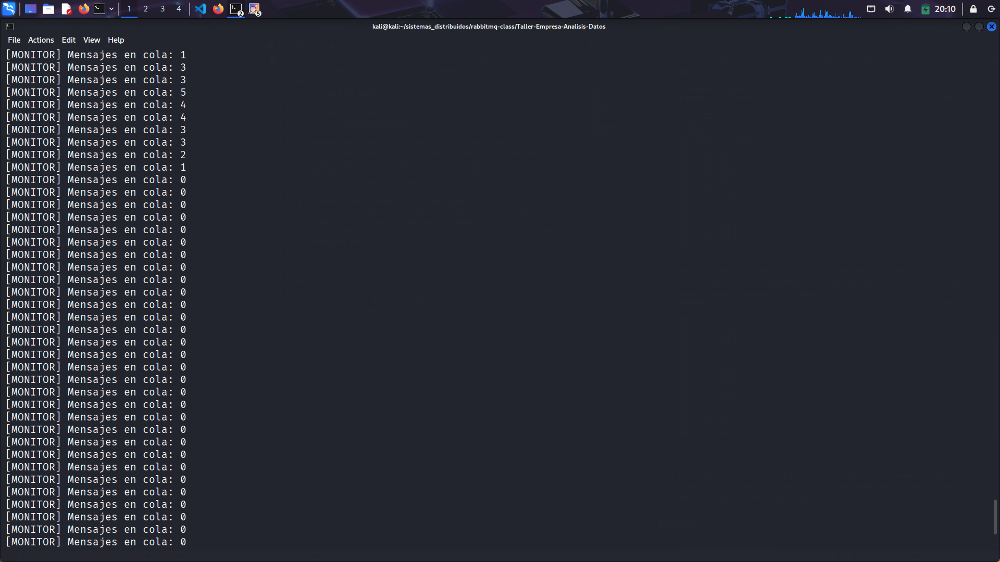

# Taller-Empresa-Analisis-Datos RABBITMQ

## Instrucciones de Prueba:

Para ejecutar el siguiente proyecto en la terminal correremos el `docker-compose.yml` de la siguiente manera:

```zsh
docker-compose up -d --build
```

y verificamos que todos nuestros contenedores se encuentren corriendo



## Flujo del sistema



1. Producer envía 10 tareas a la cola **tareas_distribuidas** en RabbitMQ.

2. RabbitMQ reparte las tareas entre los dos workers usando round-robin y prefetch_count=1.

3. Cada worker procesa la tarea:

   3.1. Si termina bien → envía ACK.

   3.2. Si falla (simulación) → no envía ACK y RabbitMQ vuelve a ponerla en la cola.

4. El monitor consulta cada segundo el estado de la cola y muestra cuántos mensajes están pendientes.

## Evidencias de Ejecucion

1. Distribución inicial equilibrada

   El producer envia los mensajes a la cola:
   
   Cada mensaje enviado a la cola tareas_distribuidas se reparte de manera balanceada entre los workers activos.:

   - Worker 1:
     
   - Worker 2:
     

2. Tolerancia a fallos
   Si se detiene un worker, el otro continúa procesando sin pérdida de datos.

   Detenemos el worker 1:
   

   Ademas vemos que la ultima tarea en enviarse al `worker 1` fue la tarea No.`1414` la cual no registra su estado completado, si nos vamos al registro del `worker 2` veremos que se le reasigna esta tarea y la completa:
   

3. Procesamiento completo sin pérdidas
   Una vez enviados todos los mensajes, la cola queda vacía y cada tarea fue procesada correctamente.
   Verificamos el registro de tareas del monitor mostrando Mensajes en cola: 0.:
   

## Autores

- Juan Sebastian Barajas Vargas
- Vitys Steeven Benavides Avila
